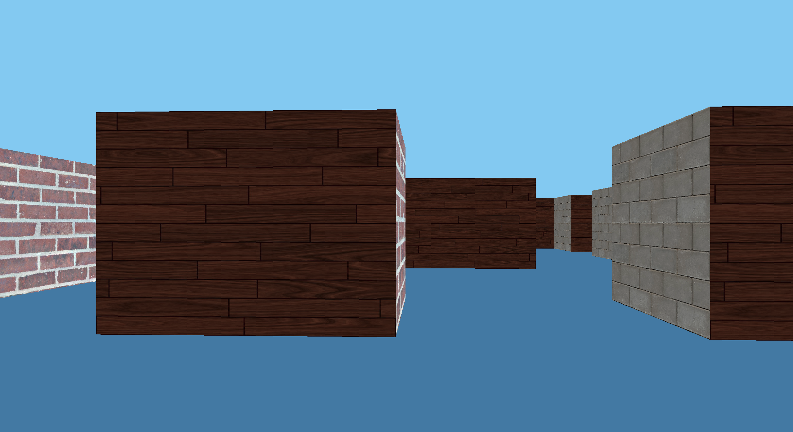
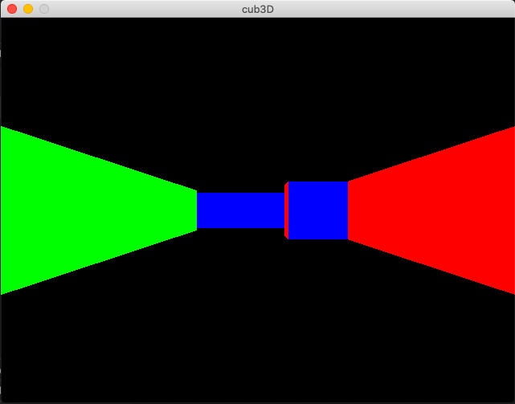
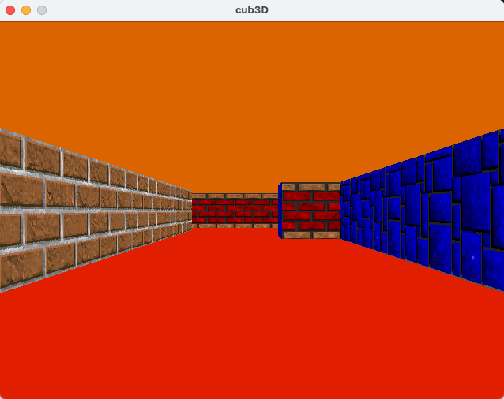
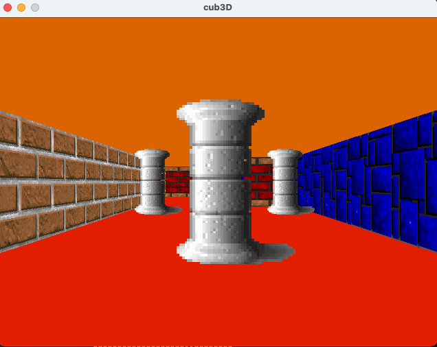

# cub3D
This 42 School project is inspired by the world-famous eponymous 90’s game, which was the first FPS ever. Its purpose is to explore ray-casting.

## Summary:

> This project is inspired by the world-famous eponymous 90’s game, which was the first FPS ever. It will enable you to explore ray-casting. Your goal will be to make a dynamic view inside a maze, in which you’ll have to find your way.

My first RayCaster with miniLibX

## To play:

> Clone this directory and call make in the root. This should create an executable called 'cub3D'

> Call ./cub3D with a valid map for example: ./cub3D ./maps/1working-example.cub

> Now, you can move around with WASD and look left and right with →← and exit with ESC

## Goals: it’s your turn to relive history and write a 3D video game

• This project’s objectives are similar to all this first year’s objectives: 

`Rigor, use of C, use of basic algorithms, information research etc.`
• As a graphic design project, cub3D will enable you to improve your skills in these areas: windows, colors, events, fill shapes, etc.
• To conclude cub3D is a remarkable playground to explore the playful practical applications of mathematics without having to understand the specifics.
• With the help of the numerous documents available on the internet, you will use mathematics as a tool to create elegant and efficient algorithms.
• We recommend that you test the original game before starting this project: [http://users.atw.hu/wolf3d/](http://users.atw.hu/wolf3d/)

**Figure: Example of what your project could look like as per the mandatory part.**



## Mandatory Part:

**Program name:**               `cub3D`
**Turn in files:**                    `all your files`
**Makefile:**                          `all, clean, fclean, re, bonus`
**Arguments:**                     `a map in format *.cub`
**External functions:**
                                         `open, close, read, write, printf, malloc, free, perror, strerror, exit`
 All functions of the       `math library` (-lm man man 3 math)
 All functions of the       `MinilibX`
**Libft authorised:**             `Yes`
**Description:**                     You must create a “realistic” 3D graphical representation of the inside of a maze from a first person perspective. You have to create this representation using the Ray-Casting principles mentioned earlier.

## The constraints are as follows:

- You must use the miniLibX. Either the version that is available on the operating system, or from its sources. If you choose to work with the sources, you will need to apply the same rules for your libft as those written above in Common Instructions part.
- The management of your window must remain smooth: changing to another window, minimizing, etc.
- Display different wall textures (the choice is yours) that vary depending on which side the wall is facing (North, South, East, West).
- Your program must be able to display an item (sprite) instead of a wall.
- Your program must be able to set the floor and ceilling colors to two different ones.
- In case the Deepthought has eyes one day to evaluate your project, your program must save the first rendered image in bmp format when its second argument is "––save".
- If no second argument is supplied, the program displays the image in a window and respects the following rules:
 - The left and right arrow keys of the keyboard must allow you to look left and right in the maze.
 - The W, A, S and D keys must allow you to move the point of view through the maze.
 - Pressing ESC must close the window and quit the program cleanly.
 - Clicking on the red cross on the window’s frame must close the window and quit the program cleanly.
 - If the declared screen size in the map is greater than the display resolution, the window size will be set depending to the current display resolution.
 - The use of images of the minilibX is strongly recommended.
- Your program must take as a first argument a scene description file with the .cub extension.
 - The map must be composed of only 4 possible characters: 0 for an empty space, 1 for a wall, 2 for an item and N,S,E or W for the player’s start position and spawning orientation.
This is a simple valid map:
111111
100101
102001
1100N1
111111
 - The map must be closed/surrounded by walls, if not the program must return an error.
 - Except for the map content, each type of element can be separated by one or more empty line(s).
 - Except for the map content which always has to be the last, each type of element can be set in any order in the file.
 - Except for the map, each type of information from an element can be separated by one or more space(s).
 - The map must be parsed as it looks like in the file. Spaces are a valid part of the map, and is up to you to handle. You must be able to parse any kind of map, as long as it respects the maps rules.                                                                            - Each element (except the map) firsts information is **the type identifier** (composed by one or two character(s)), followed by **all specific informations for each object in a strict order** such as :
*** Resolution:**
     `R 1920 1080`
      · identifier: R
      · x render size
      · y render size
*** North texture:**
      `NO ./path_to_the_north_texture`
       · identifier: NO
       · path to the north texture
*** South texture:**
      `SO ./path_to_the_south_texture`
      · identifier: SO
      · path to the south texture
*** West texture:**
     `WE ./path_to_the_west_texture`
     · identifier: WE
     · path to the west texture
*** East texture:**
     `EA ./path_to_the_east_texture`
     · identifier: EA
     · path to the east texture
*** Sprite texture:**
     `S ./path_to_the_sprite_texture`
      · identifier: S
      · path to the sprite texture
*** Floor color:**
     `F 220,100,0`
     · identifier: F
     · R,G,B colors in range [0,255]: 0, 255, 255                                                                                                                                    *** Ceiling color:**
     `C 225,30,0`
     · identifier: C
     · R,G,B colors in range [0,255]: 0, 255, 255
- Example of the mandatory part with a minimalist .cub scene:

```docker
R 1920 1080
NO ./path_to_the_north_texture
SO ./path_to_the_south_texture
WE ./path_to_the_west_texture
EA ./path_to_the_east_texture
S ./path_to_the_sprite_texture
F 220,100,0
C 225,30,0
           1111111111111111111111111
           1000000000110000000000001
           1011000001110000002000001
           1001000000000000000000001
111111111011000001110000000000001
100000000011000001110111111111111
11110111111111011100000010001           
11110111111111011101010010001
11000000110101011100000010001
10002000000000001100000010001
10000000000000001101010010001
11000001110101011111011110N0111
11110111 1110101 101111010001
11111111 1111111 111111111111
```

- If any misconfiguration of any kind is encountered in the file, the program must exit properly and return "Error\n" followed by an explicit error message of your choice.

# HOW TO START?

FIRST THINGS FIRST > You have to learn 2 concepts to start/understand this project:

1. MiniLibX library = check out my cub3D-minilibx.pdf
2. Ray-Casting = check out my cub3D-raycasting.pdf

HOWEVER > Even before these concepts you should learn about image representation on a computer. 

```c
Here are a few concepts and links. Don't hesitate to do more research where you need. 
pixel? rgb? bits? bytes? width? height? depth? size on disk? 
> [https://www.collabora.com/news-and-blog/blog/2016/02/16/a-programmers-view-on-digital-images-the-essentials/](https://www.collabora.com/news-and-blog/blog/2016/02/16/a-programmers-view-on-digital-images-the-essentials/) 
How do computers store images: [https://www.youtube.com/watch?v=EXZWHumclx0&ab_channel=Udacity](https://www.youtube.com/watch?v=EXZWHumclx0&ab_channel=Udacity)
Image, Pixels, and RGB: [https://www.youtube.com/watch?v=15aqFQQVBWU&ab_channel=Code.org](https://www.youtube.com/watch?v=15aqFQQVBWU&ab_channel=Code.org)
Digital Images, Channels, Depth: [https://www.youtube.com/watch?v=06OHflWNCOE&ab_channel=Computerphile](https://www.youtube.com/watch?v=06OHflWNCOE&ab_channel=Computerphile)
How 3-D Graphics Work > [https://computer.howstuffworks.com/3dgraphics.htm](https://computer.howstuffworks.com/3dgraphics.htm)
```

### How to structure your code?

My thoughts in the beginning of this project: I am only able to render one red dot into the terminal by using miniLibX tutorials. I have no idea how I will end up writing a 3D game. That's how lost I am. 

### `my structure as an example:`

1. **input validation**

    checking the extension, --save, number of arguments.

2. **initiate the game**

    init () funcs for two purposes:

    One > if needed put initial values to struct variables & create memory

    Two > init mlx & window etc. (after parsing the scene description & map?)

    parse scene description file (map.cub)

    - open, read w/gnl, close
    - for each line as a result of calling gnl: different infos & validations to handle
        - handle white space (ft_iswhitespace & ft_strtrim might be useful?)
        - parse window size (is there a maximum & minimum for this?)
        - parse floor & ceiling colour info (rgb calculation here?)
        - parse texture info & path
        - parse map info (NWSE012) & starting position
3. **build & play the game (follow lode's tutorial)**

    hooks > key_press & key_release & exit

    loop > handle_loop > update image & window etc.

4. **finish the game**
5. **handle errors**

an error function that takes specified error msg:

if we are allowed to use exit() > create an error function and pass specific error messages, print it with ft_putstr + use exit() inside this function

Little tips & questions:

- Having structs inside structs i.e separate structs for window info, map info, image info but connect all of the to window info or a big t_struct game.
- How should I save map info so that I can do calculations for the player's view? in an int array 2d matrix array or ? what kind of a struct for all of the map info? + also you need to free things before you exit!

## Things done as I go

- [x]  learn how to work with mlx & create your Makefile
- [x]  parse scene description file (resolution, colours, texture), create different structs to hold these information
- [x]  error checks: map is not last info, empty lines inside map, invalid char inside map
- [x]  parse map, save lines in a linked list, move list to 2D array, check starting position, implement flood fill for map validity, restore map to its old state
- [x]  error: multiple starting position, if no map provided,  zero's at outer walls of the map
- [x]  parse_check() > error: invalid/no resolution, invalid/no colour, no texture path
- [x]  init() for structs and mlx etc.
- [x]  learn ray-casting
- [x]  adjust ray-casting tutorial's untextured raycaster code to your project and implement it
- [x]  different colours for different wall sides, colour the ceiling and floor as well
- [x]  hooks: move forward, backward, left, right + look left, right functions + exit event and esc key > exits the game cleanly
- [x]  textures → apply textures to walls based on lodev's tutorial (beforehand, I was only colouring the walls)
- [x]  sprites → first draw one sprite with , then handle parsing the sprites with the position, lastly sort sprites for drawing further/closer.
- [x]  bitmap → save the first rendered image in bmp format when its second argument is "––save"
- [x]  fixed error function 'ft_exit' and added free's where needed
- [x]  fixed init functions, free'd map_list
- [x]  added check_borders function to check the first row-col and last row-col for 1's (after discussion with peers)
- [x]  added 8 direction floodfill to check_map
- [x]  changed the way I parse sprites to avoid memory leak and abort problem
- [x]  bash script for error test cases & maps
- [x]  norm check, libft  & gnl new norm check!
- [x]  memory leak check (valgrind, Instruments, leaks)

**Increase in memory when movement key is first pressed**

A great way to see the physical footprint of you program is to use top or htop (or a gui taskmanager). That will show your usage in real time. I agree that an initial spike is probably fine. Maybe just try to keep walking around for at least 5 sec and see if there is a (consistent) increase after that. or use your activity monitor and check cub3D memory usage while you play.

**BEFORE SUBMITTING:**

study your makefile

study ray-casting

study bitmaps

## TIMELINE OF MY CUB3D JOURNEY

Week 1: I tried to find which sources are out there about this project. I followed the miniLibX tutorial by Harm Smits. It seemed a bit complex in the beginning but once I understood what the library is for, I also understood what the project is all about. My thought is that I will try to draw pixels to a window according to a map consisting of walls, floors, sky etc. This window is seen from the player's perspective (this is where ray-casting comes into play but I will look into it after I completely figure out miniLibX and changing how window looks upon events). So, the next step is to change the window view (player's perspective) every time an event happens like moving forward or backward & looking up and down etc.)

Week 2: Finally, I was able to change the image once an event happened and put it to the window. (changing colours, moving the square) MiniLibX tutorial is finished. + I tried to come up with a basic structure for the code by examining different examples. + I started parsing the scene description file!

Week 3: Parsed resolution, colours, textures! Parsed the map = a bit harder than expected. Wrote error functions and parse check function to avoid any errors. Wrote a bash script to check every possible error with example maps. + Followed lodev's ray-casting tutorial and tried to understand its logic. Took notes on how to apply it to my project.

Week 4: Light week due to back pain. Mostly implemented lodev's untextured raycasting logic to my cub3D but there was a bug and it took me the whole week to figure it out but in the end I was able to draw the player's perspective with the walls coloured based on their side. Here is a pic of how it looked like. Remaining parts for next week: adding textures to walls, sprites, moving with keys and rotating the view.



Week 5: Finally able to move around the map. Moving up, down, left, right and looking left and right.  

Week 6: Implemented lodev's textured raycasting logic to my cub3D. The only difference is that lodev generated the textures but I upload it from an image. It's a bit hard to grasp for me. So, I researched how to get the color info from an image based on the position of the pixel. It's still not clear to me at the end of this week I have an overall structure which needs some bug fixing.  I finally understood how to get color info from texture images. It's basically the inverse of putting pixels to the screen image. Check out my pixel_get and pixel_put functions. At the end of the week, I applied different textures to each side of the wall. I also draw floor and ceiling with different colour parsed from map.cub.



Week 7: Implemented lodev's sprites logic to my cub3D. The difference with lodev is that cub3D uses one type of sprite.png. Also, only the sprites in player's view should be drawn. So, while raycasting the coordinates of each sprite in the view should be saved. I've used linked list to store these values. It's been a bumpy road (with a lot of segfaults and speed problems) > Later on I changed this approach and saved sprites and their coordinates in the parsing part and applied sprite drawing. In the end, only the ones in the view are drawn when calculations are taken into consideration. This way, I got rid of using malloc in the game loop which was really dangerous memory-wise.



Week 8: Whole week was spent trying to solve the speed problem with sprites. I took so long and got so boring that I tried to write the screenshot bitmap part. There are some memory problems but I think I got the hang of it. With sprites, I thought it might be a memory problem and spent a good day on re-learning how to check memory leaks. While doing so I accidentally deleted all the printf's in my sprite code (I was using them to see the coordinates), and VOLA the speed problem disappeared! It turned out to be just calling too many printf's in my mlx_loop. (19.04.2021)

Week 9:  Wrote sort_sprite function to draw sprites from furthest to nearest. Fixed further sprite inside near sprite problem. Wrote the functions to save the first rendered image in bmp format when its second argument is "––save". Separated ft_exit and ft_exit_basic (for validate_input part) to prevent seg fault before window is created. 

Week 10:  rewrote the sprite and texture handling. adjusted max resolution problem. adjusted code to fulfil the following requirement "the screenshot needs to be taken, without any window being opened" checked for memory leaks and norm compliance. learnt apple Instruments for leaks and how to build a docker environment with linux to use valgrind. wrote a whole new logic for checking the funny shaped maps like the one in the subject.pdf example. In the end, with 8 floodfiil I am checking if the player cannot escape the walls + literal meaning of 'map should be surrounded by walls' and checking each char in the outer walls.

---

## Makefile

Since libft functions are allowed in this project, we have to add that to our directory and find a way to create libft. So, in the green part first I am compiling libft eventually creating libft.a and using it as a libray to compile program. As for get_next_line, I put it in the srcs part and just compiled with everything else since it will not create a library. 

+

Because MiniLibX requires Appkit and X11 we need to link them accordingly (in LINKS. This can cause a complicated compilation process. A basic compilation process looks as follows: For object files, you could add the following rule to your makefile, assuming that you have the `libmlx.a` source in a directory named `minilibx_opengnl` in the root of your project:

```makefile
SRCS	=	utils/gnl/get_next_line.c utils/gnl/get_next_line_utils.c \
			main.c error.c init.c \
			parse.c parse_other.c map_handle.c map_check.c map_check_2.c\
			hooks.c move.c rotate.c \
			draw.c ray-casting.c texture.c sprite.c get_sprites.c \
			pixel_funcs.c bitmap.c\

OBJS	= $(SRCS:.c=.o)

NAME	= cub3D

GCC		= gcc

FLAGS	= -Wall -Wextra -Werror -fsanitize=address -g

HEADER_FILE = cub3d.h

MLX_DIR	= minilibx_opengl

MLX_LIB = libmlx.a

LIBFT_DIR = utils/libft

LIBFT_LIB = libft.a

LINKS = -framework OpenGL -framework AppKit

all:	$(NAME)

$(NAME):	$(OBJS)
	$(MAKE) bonus -C $(LIBFT_DIR)
	$(MAKE) -C $(MLX_DIR)
	$(GCC) $(FLAGS) -o $(NAME) $(OBJS) $(LIBFT_DIR)/$(LIBFT_LIB) $(MLX_DIR)/$(MLX_LIB) $(LINKS)

%.o: %.c $(HEADER_FILE)
	@echo "$(GREEN)Compiling:$(NORMAL)"
	$(GCC) -c $< -o $(<:.c=.o)
	@echo "$(GREEN)Successfully compiled!$(NORMAL)"
```

## **Research & References**

### **Core**

I built the graphics engine using this tutorial: [Lode's Computer Graphics Tutorial](https://lodev.org/cgtutor/raycasting.html) & peer2peer communication

### Helpful **Graphics Resources**

- [🎥 DDA Line Drawing Algorithm](https://www.youtube.com/watch?v=W5P8GlaEOSI)

### Create **Bitmap**

- [Man open()](https://man7.org/linux/man-pages/man2/open.2.html)
- [https://medium.com/sysf/bits-to-bitmaps-a-simple-walkthrough-of-bmp-image-format-765dc6857393](https://medium.com/sysf/bits-to-bitmaps-a-simple-walkthrough-of-bmp-image-format-765dc6857393)
- [O_CREAT mode argument](https://stackoverflow.com/a/28466757)
- [https://en.wikipedia.org/wiki/BMP_file_format](https://en.wikipedia.org/wiki/BMP_file_format)

### MLX

- [https://harm-smits.github.io/42docs/libs/minilibx](https://harm-smits.github.io/42docs/libs/minilibx)

### Further **References**

[https://github.com/qst0/ft_libgfx](https://github.com/qst0/ft_libgfx)

[https://ryanclark.me/rgb-to-hex-via-binary-shifting/](https://ryanclark.me/rgb-to-hex-via-binary-shifting/)

[https://lodev.org/cgtutor/floodfill.html#8-Way_Recursive_Method_floodFill8](https://lodev.org/cgtutor/floodfill.html#8-Way_Recursive_Method_floodFill8)
